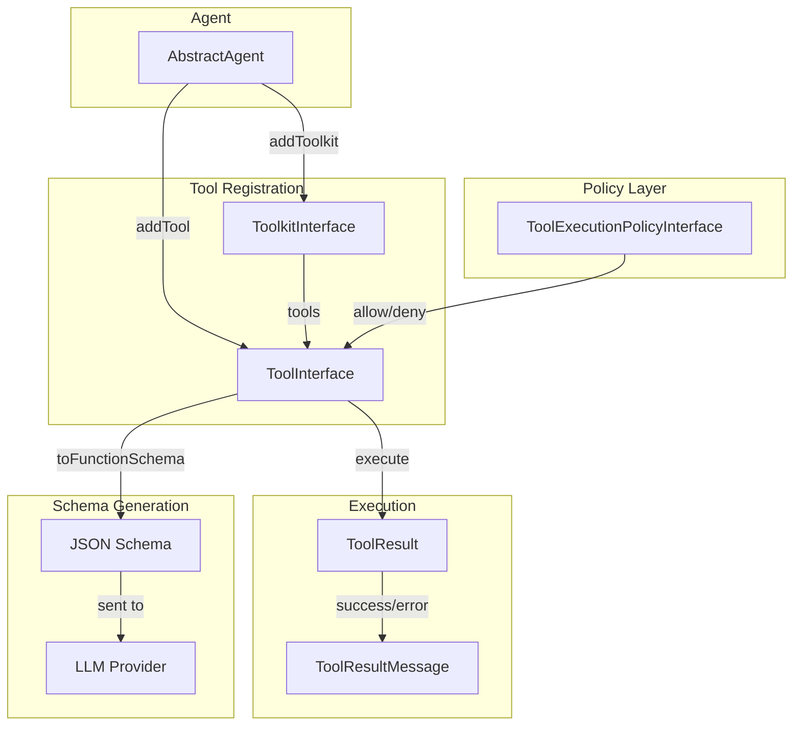
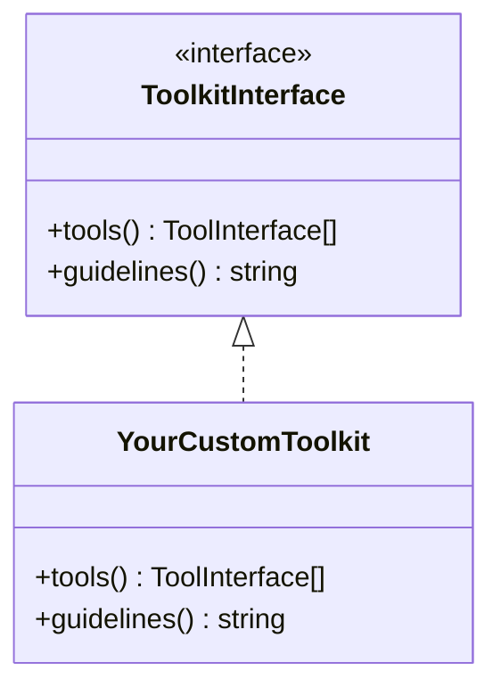

# Tools & Toolkits

Tools are the actions an agent can take. Toolkits group related tools with shared context and guidelines.

## Tool System Overview



## Creating Tools

### Basic Tool

```php
use CarmeloSantana\PHPAgents\Tool\Tool;
use CarmeloSantana\PHPAgents\Tool\ToolResult;
use CarmeloSantana\PHPAgents\Tool\Parameter\StringParameter;

$greet = new Tool(
    name: 'greet',
    description: 'Greet someone by name',
    parameters: [
        new StringParameter('name', 'The person to greet', required: true),
    ],
    callback: fn(array $args): ToolResult => ToolResult::success(
        "Hello, {$args['name']}!",
    ),
);
```

### Parameter Types

| Class | JSON Schema Type | Extra Options |
|-------|-----------------|---------------|
| `StringParameter` | `string` | — |
| `NumberParameter` | `number` | — |
| `BoolParameter` | `boolean` | — |
| `EnumParameter` | `string` (enum) | `values: string[]` |
| `ArrayParameter` | `array` | `items: Parameter` |
| `ObjectParameter` | `object` | `properties: Parameter[]` |

```php
use CarmeloSantana\PHPAgents\Tool\Parameter\{
    StringParameter,
    NumberParameter,
    BoolParameter,
    EnumParameter,
    ArrayParameter,
    ObjectParameter,
};

$tool = new Tool(
    name: 'create_event',
    description: 'Create a calendar event',
    parameters: [
        new StringParameter('title', 'Event title', required: true),
        new StringParameter('date', 'ISO 8601 date', required: true),
        new NumberParameter('duration', 'Duration in minutes'),
        new BoolParameter('recurring', 'Whether the event repeats'),
        new EnumParameter(
            name: 'priority',
            description: 'Event priority level',
            values: ['low', 'medium', 'high'],
        ),
        new ArrayParameter(
            name: 'attendees',
            description: 'List of attendee emails',
            items: new StringParameter('email', 'Attendee email'),
        ),
    ],
    callback: fn(array $args): ToolResult => ToolResult::success(
        json_encode($args),
    ),
);
```

### Parameter Validation

Required parameters are validated before the callback is invoked. If any required parameter is missing from the LLM's arguments, the tool returns an error without executing:

```php
// If the LLM calls greet({}) without 'name', it gets:
// ToolResult::error("Missing required parameters: name")
```

Declared parameter constraints are also enforced at runtime before the callback runs.
This means schema hints like string patterns, max length, enum values, numeric min/max,
and nested array/object parameter rules now protect the callback from invalid input.

```php
$tool = new Tool(
    name: 'create_project',
    description: 'Create a project',
    parameters: [
        new StringParameter('slug', 'Lowercase slug', pattern: '/^[a-z-]+$/'),
        new NumberParameter('count', 'Project count', required: false, integer: true, minimum: 1),
    ],
    callback: fn(array $args): ToolResult => ToolResult::success(
        sprintf('Creating %s x%d', $args['slug'], $args['count'] ?? 1),
    ),
);

// Invalid values fail before the callback executes:
// ToolResult::error('Parameter validation failed: Parameter "slug" does not match the required pattern. ...')
```

Validation remains additive and backward-compatible:
- Tools without extra constraints keep their current behavior
- Valid inputs continue to reach the callback unchanged
- Numeric parameters may be normalized before execution when the declared type allows it

### Tool Results

Tools return `ToolResult` with a status and content:

```php
use CarmeloSantana\PHPAgents\Tool\ToolResult;
use CarmeloSantana\PHPAgents\Enum\ToolResultStatus;

// Success
ToolResult::success('File created at /path/to/file.txt');

// Error
ToolResult::error('Permission denied: /etc/passwd');

// Structured JSON helper — still stored as string content for provider compatibility
ToolResult::json([
    'id' => 'artifact_123',
    'status' => 'created',
]);

// With call ID (set automatically by the agent loop)
new ToolResult(
    status: ToolResultStatus::Success,
    content: 'Done',
    callId: 'call_abc123',
);
```

`ToolResult` now also supports additive metadata and display hints without changing the
provider wire format. This is useful for internal inspection, UI hints, or future routing
logic while keeping `content` as a plain string.

```php
$result = ToolResult::success('Finished')
    ->withMetadata(['phase' => 'apply'])
    ->withMimeType('text/plain')
    ->withDisplayHint('plain-text');
```

### Custom Tool Classes

For complex tools, implement `ToolInterface` directly:

```php
<?php

declare(strict_types=1);

namespace Acme\Tools;

use CarmeloSantana\PHPAgents\Contract\ToolInterface;
use CarmeloSantana\PHPAgents\Tool\Parameter\StringParameter;
use CarmeloSantana\PHPAgents\Tool\ToolResult;

final class DatabaseQueryTool implements ToolInterface
{
    public function __construct(
        private readonly \PDO $db,
    ) {}

    public function name(): string
    {
        return 'query_database';
    }

    public function description(): string
    {
        return 'Execute a read-only SQL query against the database';
    }

    public function parameters(): array
    {
        return [
            new StringParameter('sql', 'The SQL SELECT query to execute', required: true),
        ];
    }

    public function execute(array $input): ToolResult
    {
        $sql = $input['sql'] ?? '';

        if (!str_starts_with(strtoupper(trim($sql)), 'SELECT')) {
            return ToolResult::error('Only SELECT queries are allowed');
        }

        try {
            $stmt = $this->db->query($sql);
            $rows = $stmt->fetchAll(\PDO::FETCH_ASSOC);
            return ToolResult::success(json_encode($rows, JSON_PRETTY_PRINT));
        } catch (\PDOException $e) {
            return ToolResult::error('Query failed: ' . $e->getMessage());
        }
    }

    public function toFunctionSchema(): array
    {
        return [
            'type' => 'function',
            'function' => [
                'name' => $this->name(),
                'description' => $this->description(),
                'parameters' => [
                    'type' => 'object',
                    'properties' => [
                        'sql' => [
                            'type' => 'string',
                            'description' => 'The SQL SELECT query to execute',
                        ],
                    ],
                    'required' => ['sql'],
                ],
            ],
        ];
    }
}
```

## Toolkits

Toolkits group related tools and provide guidelines that are injected into the system prompt.

php-agents provides `ToolkitInterface` as the contract, and your application supplies the implementations. The one that ships with the library is [`McpToolkit`](#mcp-servers), which exposes an approved subset of a remote MCP server's tools (`grep -rn 'implements ToolkitInterface' src/`). Downstream products like [Coqui](https://github.com/AgentCoqui/coqui) provide filesystem, shell, memory, and other toolkits as separate packages.



### Creating a Toolkit

```php
<?php

declare(strict_types=1);

namespace Acme\Toolkit;

use CarmeloSantana\PHPAgents\Contract\ToolkitInterface;
use CarmeloSantana\PHPAgents\Tool\Tool;
use CarmeloSantana\PHPAgents\Tool\ToolResult;
use CarmeloSantana\PHPAgents\Tool\Parameter\StringParameter;
use CarmeloSantana\PHPAgents\Tool\Parameter\EnumParameter;

final class GitToolkit implements ToolkitInterface
{
    public function __construct(
        private readonly string $repoPath,
    ) {}

    public function tools(): array
    {
        return [
            new Tool(
                name: 'git_status',
                description: 'Show the working tree status',
                parameters: [],
                callback: fn(array $args): ToolResult => $this->execGit('status --porcelain'),
            ),
            new Tool(
                name: 'git_log',
                description: 'Show recent commit history',
                parameters: [
                    new StringParameter('count', 'Number of commits to show'),
                ],
                callback: fn(array $args): ToolResult => $this->execGit(
                    sprintf('log --oneline -n %d', (int) ($args['count'] ?? 10)),
                ),
            ),
            new Tool(
                name: 'git_diff',
                description: 'Show changes in the working tree',
                parameters: [
                    new StringParameter('path', 'File path to diff'),
                    new EnumParameter('type', 'Diff type', values: ['staged', 'unstaged']),
                ],
                callback: fn(array $args): ToolResult => $this->execGit(
                    sprintf(
                        'diff %s -- %s',
                        ($args['type'] ?? 'unstaged') === 'staged' ? '--cached' : '',
                        escapeshellarg($args['path'] ?? '.'),
                    ),
                ),
            ),
        ];
    }

    public function guidelines(): string
    {
        return <<<GUIDELINES
        Use git tools to inspect repository state:
        - Use git_status before making changes to understand the current state
        - Use git_log to understand recent history
        - Use git_diff to review specific changes before committing
        GUIDELINES;
    }

    private function execGit(string $subcommand): ToolResult
    {
        $cmd = sprintf('cd %s && git %s', escapeshellarg($this->repoPath), $subcommand);
        $output = shell_exec($cmd);

        return $output !== null
            ? ToolResult::success($output)
            : ToolResult::error('Git command failed');
    }
}
```

### Optional Rich Tool Documentation

If a tool needs richer generic prompt documentation than its name, description, and
parameter list, it can optionally implement `ToolDocumentationInterface`.

```php
use CarmeloSantana\PHPAgents\Contract\ToolDocumentationInterface;

final class SearchTool implements ToolInterface, ToolDocumentationInterface
{
    public function useWhen(): ?string
    {
        return 'Use this when you know the capability you need but not the exact record ID.';
    }

    public function examples(): array
    {
        return [
            'query: "recent invoices"',
            'query: "customer by email"',
        ];
    }

    // ... remaining ToolInterface methods ...
}
```

`SystemPrompt::withTools()` uses this interface to render optional “Use when” guidance and
examples in the generic tool docs. Provider tool schemas are unchanged.

## Tool Execution Policies

Control which tools can execute via `ToolExecutionPolicyInterface`:

```php
<?php

declare(strict_types=1);

namespace Acme\Policy;

use CarmeloSantana\PHPAgents\Contract\ToolExecutionPolicyInterface;

final class ReadOnlyPolicy implements ToolExecutionPolicyInterface
{
    private const WRITE_TOOLS = ['write_file', 'delete_file', 'create_directory'];

    public function shouldExecute(string $toolName, array $arguments): true|string
    {
        return in_array($toolName, self::WRITE_TOOLS, true)
            ? "{$toolName} is disabled in read-only mode."
            : true;
    }
}
```

Register on the agent:

```php
$agent = new MyAgent(
    provider: $provider,
    executionPolicy: new ReadOnlyPolicy(),
);
```

A returned string denies the call, and the agent turns it into an error tool result whose content
is `Denied by policy: ` followed by that string, so the model reads it (`src/Agent/AbstractAgent.php`;
`grep -rn 'Denied by policy' src/` finds the one site). Returning `true` lets the call through.

## MCP servers

`CarmeloSantana\PHPAgents\Mcp` is a client for remote [Model Context Protocol](https://modelcontextprotocol.io)
servers over Streamable HTTP. It lists a server's tools (`tools/list`) and calls them
(`tools/call`), and under 2025-11-25 it also posts the `initialize` and
`notifications/initialized` handshake those two need. It speaks the 2026-07-28 and the
2025-11-25 revisions and picks between them itself.

Authentication is whatever static headers you configure, sent on every request. There is no
OAuth and no STDIO transport in this namespace (`grep -rni 'oauth\|stdio' src/` prints
nothing), and the client only ever posts to `McpServer::$url`.

### A complete example

```php
use CarmeloSantana\PHPAgents\Mcp\McpClient;
use CarmeloSantana\PHPAgents\Mcp\McpServer;
use CarmeloSantana\PHPAgents\Mcp\McpToolkit;
use Symfony\Component\HttpClient\HttpClient;

$server = new McpServer(
    url: 'https://mcp.example.com/mcp',
    headers: ['Authorization' => 'Bearer ' . getenv('EXAMPLE_MCP_TOKEN')],
);
$client = new McpClient($server, HttpClient::create());

// Approve once: show each definition to a person, store name => fingerprint.
$approved = [];
foreach ($client->listTools() as $tool) {
    $approved[$tool->name] = $tool->fingerprint();
}

// Every turn: only approved, unchanged tools reach the model.
$toolkit = new McpToolkit($client, $approved, prefix: 'example', onDrift: function (array $changed): void {
    foreach ($changed as $tool) {
        error_log("MCP tool {$tool->name} changed since approval; it is withheld until re-approved.");
    }
});
```

`$toolkit` is an ordinary `ToolkitInterface`, so `$agent->addToolkit($toolkit)` is all that is
left. Its `guidelines()` returns `''`: a server's `instructions` is untrusted text and is not
passed to the model.

Exposed names come from `McpToolName::fit("{$prefix}__{$name}")`, or `fit($name)` when the
prefix is `''`. That rule returns a name made only of `[A-Za-z0-9_-]`, starting with a letter
or `_` and at most 64 characters, unchanged; any other name is cut to 55 characters and
marked with `_` plus the first 8 hex characters of `sha256($raw)`. The mark is what keeps
apart two names the rewrite would otherwise merge, `repo.search` and `repo_search`, and it is
derived from the input, so a tool gets the same exposed name on every turn. Pass a `$namer`
closure to use your own scheme.

### Pinning and drift

`fingerprint()` is a sha256 over a canonical encoding of four values: `name`,
`description`, `inputSchema` and `annotations`. The top-level `title` is not part of it,
because it is a display label; `annotations` is hashed as sent, `annotations.title` included.
Every non-list array has its keys sorted, so key order in the server's JSON does not move the
digest of an object whose keys are not all numeric strings, while lists keep their order, since
reordering an `enum` changes what a tool accepts. An object keyed `"0"` to `"n"` in order is
decoded as a list, and keeps that order. Out of order it is sorted as strings, which restores
the order while every key is a single digit but puts `"10"` before `"2"`, so from `"10"` up an
out-of-order object hashes apart from the in-order one.
The encoding is JSON, written with `serialize_precision` held at -1, so your php.ini does not
move the digest of a float such as `0.1`. A definition `json_encode()` refuses — one whose
schema holds `1e999`, which `json_decode()` reads as INF — is hashed from its `serialize()`
form instead, so rewriting its description still moves its digest. Inputs that
`json_decode($body, true)` turns into the same PHP value, such as `{}` and `[]`, hash the
same; `McpToolDefinition`'s class docblock names more.

For each tool the server lists, `McpToolkit` reads `$allow[$serverName]` and:

| The pin | What happens |
| --- | --- |
| a string equal to the live `fingerprint()` | the tool is exposed |
| a string that differs | the tool is **withheld**, and its definition is collected for `$onDrift` |
| absent | the tool is skipped, and is not reported as drift |
| present but not a string | the tool is skipped, and is **not** reported as drift either |

That last row is worth knowing before you build `$allow` from mixed storage: a `true`, an
`int` or a `null` under a tool's name reads as "no pin", silently, and `$onDrift` never hears
about it. Store fingerprints as strings.

`$onDrift` is called once per instance, with the list of drifted `McpToolDefinition`s, and only
when at least one tool drifted. A description is text the model reads and a schema is what the
model is invited to fill in, so a server that redefines an approved tool has changed what a
person approved — withholding it until someone approves the new definition is the point of the
pin. Nothing is cached across instances: build the toolkit per turn and a definition that
changed between turns is seen at once.

`definition($exposedName)` returns the live `McpToolDefinition` behind an exposed name, or
`null`. It and `tools()` share one listing per instance — whichever is called first calls
`listTools()` — and a listing that throws is not remembered, so the next call lists again.

### Sessions

Under 2025-11-25 a server may issue an `Mcp-Session-Id`, and the handshake that gets one costs
two extra round trips. Implement `McpSessionStore` to carry it (and the detected protocol
version) across PHP requests:

```php
use CarmeloSantana\PHPAgents\Mcp\McpSession;
use CarmeloSantana\PHPAgents\Mcp\McpSessionStore;

final class ApcuSessionStore implements McpSessionStore
{
    public function load(string $key): ?McpSession
    {
        $raw = apcu_fetch("mcp.{$key}", $ok);

        return $ok && is_array($raw) ? new McpSession($raw['version'], $raw['id']) : null;
    }

    public function save(string $key, McpSession $session): void
    {
        apcu_store("mcp.{$key}", ['version' => $session->protocolVersion, 'id' => $session->sessionId], 900);
    }

    public function forget(string $key): void
    {
        apcu_delete("mcp.{$key}");
    }
}
```

The `$key` is `McpServer::sessionKey()`: a sha256 of the URL and the headers with their names
sorted. It carries no credential, and changing a credential changes the key, so a new session
starts rather than an old one being reused under new authentication.

Treat `McpSession::$sessionId` as a secret — it is a bearer credential for that session — and
store it as one. The client never sends `DELETE`; it leaves expiry to the server, and calls
`forget()` when the server says the session is gone. Pass `null` for the store and the state
lives only in that `McpClient` instance.

### Limits, redirects and the injected transport

`McpServer` carries the limits the client enforces:

| Argument | Default | What it caps |
| --- | --- | --- |
| `timeout` | `30.0` | seconds, used as both the per-request idle timeout and the whole-request cap |
| `maxResponseBytes` | `1_048_576` | the HTTP response body |
| `maxResultBytes` | `65_536` | the text a tool result hands the model |
| `protocolVersion` | `null` | `null` detects; `McpServer::PROTOCOL_2026` or `PROTOCOL_2025` pins |

A pin skips detection. A pinned 2026-07-28 that draws the 400 which would otherwise mean "not
a 2026-07-28 server" is an error rather than a fallback, because a pin makes that 400 the
answer instead of a signal.

Redirects are never followed. The request goes out with `max_redirects: 0`, any 3xx throws
`McpRedirectException`, and an answer the injected client reached by following a redirect
anyway (`redirect_count` above zero) throws the same exception with a null `$location`. That
second check can refuse the answer; it cannot un-send the request, so a wrapper must keep
`max_redirects: 0` if the credential is not to reach whatever host the 3xx named.

The other limits are enforced twice on purpose: the client passes `timeout`, `max_duration`
and an `on_progress` callback that aborts past `maxResponseBytes`, and then measures the body
again after reading it and checks the status itself. That is what lets a host inject its own
`HttpClientInterface` — an SSRF-pinned egress, say — without the limits depending on the
wrapper honouring the options.

A bad URL is not rejected at construction; it surfaces as `McpTransportException` when a
request is made. A `$protocolVersion` that is neither constant, or a non-positive limit, throws
`\InvalidArgumentException` from `McpServer`'s constructor.

### Errors

```text
McpException extends \RuntimeException
├── McpTransportException          network, timeout, byte cap, unexpected statuses, and a header holding CR, LF or NUL
│   └── McpRedirectException       a 3xx, or an answer reached by following one; carries $status and $location
├── McpAuthException               401, 403; carries $status
└── McpProtocolException           malformed or unexpected response
    ├── McpRpcException            a JSON-RPC error object; carries $rpcCode, $data and $httpStatus
    └── McpUnsupportedVersionException
```

Everything in the tree is a `\RuntimeException`, so `catch (McpException $e)` is one handler
for "this server is not usable right now".

Messages are built from the method name, the HTTP or JSON-RPC status and the client's own
configured limits. `McpRpcException` also splices up to 200 bytes of the server's own
`error.message`, and `McpClient` replaces every non-empty `McpServer::$headers` value and every
session id it has held with `[redacted]` before building it. For `Authorization` and
`Proxy-Authorization`, whatever the case of the name, the value is also removed trimmed at
both ends of SP, HTAB, LF, VT, FF and CR, the bytes PCRE's `\s` matches. When that trimmed
value has the form `<scheme> <credentials>`, the scheme followed by one or more of those bytes,
its credentials part is removed on its own, so a server that echoes `sk-live-123` from
`Bearer sk-live-123 ` does not publish it. A byte outside that class that a server still
splits on — Python's `str.split()` splits on 0x1C to 0x1F, 0x85 and 0xA0, and the client sends
them — can publish the token. Other headers are matched only as configured, never
trimmed or split, and the match is literal: a credential the server decodes, encodes or
otherwise transforms before echoing it — `user:pass` from `Basic dXNlcjpwYXNz`, say — is not
removed. Treat these messages as untrusted text even so, and log them on that footing.

The `McpTransportException` for a transport failure keeps the HTTP client's exception as its
previous, and that message can quote the URL or the host — a query-string token in the URL
included, so keep secrets out of `McpServer::$url` if you log exception chains. A header name or
value holding CR, LF or NUL — a token read from a file with its trailing newline, say — is
refused before the request with an `McpTransportException` that names the method alone and has
no previous, because the HTTP client's own refusal quotes the whole header line. That check
reads header values as strings, as `McpServer::$headers`' `array<string, string>` documents. A
value given as an array is outside it: `['Authorization' => ["Bearer sk-live-123\n"]]` gets past
the check, and the HTTP client's refusal, quoting the whole header line, is chained again.

The redaction reaches what the client received. An id the client never received — a server
that puts an `Mcp-Session-Id` on a reply the client does not read that header from, and then
names that id in its own error text — is not removed, because the client never held it. MCP
assigns the session id on the `InitializeResult`, which is the reply the client reads it from,
so such an id is not one it stores or ever sends.

`McpRpcException::$data` is **not** redacted. It is the server's `error.data` as sent, because
version negotiation reads `data.supported` from it. A host that logs `$e->data` logs
unredacted server-supplied data.

Some throws from this namespace sit outside the tree, so a `catch (McpException $e)` misses
them; `grep -rn 'throw new \\' src/Mcp/` lists them. `McpServer`'s constructor throws
`\InvalidArgumentException` for a bad protocol version or a non-positive limit, and
`McpToolkit` throws `\UnexpectedValueException` when an injected `$namer` returns anything but
a non-empty string — that one is the host's own closure misbehaving, not the server.

An `McpException` raised while listing propagates to whoever called `tools()` or
`definition()`, because the library does not guess a host's failure policy. An exception
raised while *calling* a tool does not: `SchemaTool` turns it into an error `ToolResult` whose
content names the tool and quotes nothing, with the cause's class and message in the result's
metadata.

### What a tool result looks like

`callTool()` maps the server's content blocks into `ToolResult::$content`, the string the model
reads:

- `text` blocks are joined with a blank line;
- an embedded `resource` carrying `text` contributes that text after a `[resource <uri>]` line;
- when there is no text block, a non-null `structuredContent` is pretty-printed JSON placed
  first, and typed `application/json` when it ends up being the only part;
- other blocks become one-line placeholders — `[image <mime>, <n> bytes]`, the same for
  `audio`, `[resource <uri> (<mime>), <n> bytes]` for a blob, `[resource_link <name> <uri>]`,
  and `[<type> block]` for a type the mapper has no shape for — so the model learns the block
  arrived without being handed any base64;
- content longer than `maxResultBytes` is cut with `mb_strcut` and gets a
  `\n[truncated: <shown> of <total> bytes]` note, and loses the JSON mime type.

Every block is kept as sent in `$result->metadata['mcp']['content']`, beside `isError`, `bytes`
(the size before the cap), `truncated`, and `structuredContent` when the result carried that
key. `ToolResultMessage::toArray()` copies only the content and the call id into the message it
sends, so the metadata is for your code and your logs, not for the model.

A result the server marked `isError` comes back as an error `ToolResult` with the error code
`mcp_tool_error`, not as an exception — the model is meant to read it and try something else.
A JSON-RPC error is the other case, and that throws `McpRpcException`.

### Asking a person before a destructive call

`McpToolDefinition` reads the MCP tool annotations with the specification's defaults:

| Method | True when |
| --- | --- |
| `readOnly()` | `readOnlyHint === true` |
| `destructive()` | not read-only and `destructiveHint !== false` |
| `idempotent()` | not read-only and `idempotentHint === true` |
| `openWorld()` | `openWorldHint !== false` |

A hint counts only when it is a boolean; anything else reads as absent. Note the shape of
`destructive()`: **an unannotated tool counts as destructive.** These are hints from the
server, which is the party you are gating, so they are untrusted — use them to decide when to
ask a person, never to grant anything.

```php
use CarmeloSantana\PHPAgents\Contract\ToolExecutionPolicyInterface;
use CarmeloSantana\PHPAgents\Mcp\McpToolkit;

final class ConfirmDestructivePolicy implements ToolExecutionPolicyInterface
{
    public function __construct(private McpToolkit $toolkit, private \Closure $confirm) {}

    public function shouldExecute(string $toolName, array $arguments): true|string
    {
        $definition = $this->toolkit->definition($toolName);
        if ($definition === null || !$definition->destructive()) {
            return true;
        }

        return ($this->confirm)($toolName, $arguments) ? true : "{$toolName} needs confirmation and was not confirmed.";
    }
}
```

`shouldExecute()` is handed the name the model called, which is the exposed name
`definition()` takes. A name from some other tool or toolkit gets `null` back and is allowed
through by this policy, which is why the `null` branch is worth writing deliberately.

### Bringing your own transport

`McpToolkit` depends on `McpClientInterface`, not on `McpClient`, so a host that already has a
transport of its own — a STDIO client, say — can keep it and still get pinning, drift and
naming:

```php
use CarmeloSantana\PHPAgents\Mcp\McpClientInterface;
use CarmeloSantana\PHPAgents\Mcp\McpToolDefinition;
use CarmeloSantana\PHPAgents\Tool\ToolResult;

final class StdioMcpClient implements McpClientInterface
{
    public function __construct(private MyStdioSession $session) {}

    public function listTools(): array
    {
        return array_map(
            static fn(array $t): McpToolDefinition => new McpToolDefinition(
                $t['name'],
                $t['description'] ?? '',
                $t['inputSchema'] ?? [],
                $t['annotations'] ?? [],
                $t['title'] ?? null,
            ),
            $this->session->request('tools/list')['tools'] ?? [],
        );
    }

    public function callTool(string $name, array $arguments): ToolResult
    {
        $result = $this->session->request('tools/call', ['name' => $name, 'arguments' => $arguments]);

        return ($result['isError'] ?? false) === true
            ? ToolResult::error($result['text'] ?? 'The tool reported an error.')->withErrorCode('mcp_tool_error')
            : ToolResult::success($result['text'] ?? '');
    }
}
```

Feed it the values `json_decode($body, true)` returns, since that is what `fingerprint()` is
computed over: pins made against one transport then keep matching under the other.

### Strauss and PHP-Scoper

No Symfony class name appears inside a string anywhere in `src` — `grep -rn "'Symfony" src`
prints nothing, which is the check that keeps it so. The MCP client reaches those types
through `use` statements and type declarations, which a prefixer rewrites along with the rest
of the code, so nothing here breaks under Strauss or PHP-Scoper. A host that prefixes its
dependencies should inject its own prefixed `HttpClientInterface` instance; `McpClient` takes
the interface and constructs no HTTP client of its own.

## Raw JSON Schema tools

`Tool` builds its schema from typed `Parameter` objects and validates the model's arguments
against them. A schema that came from somewhere else — an MCP server's `inputSchema` — has
constructs no `Parameter` models (`oneOf`, `$ref`, formats), and its publisher validates its
own input. `SchemaTool` is for that case, and `McpToolkit` builds one per exposed tool.

```php
use CarmeloSantana\PHPAgents\Tool\SchemaTool;
use CarmeloSantana\PHPAgents\Tool\ToolResult;

$tool = new SchemaTool(
    name: 'search_docs',
    description: 'Search the handbook',
    schema: ['type' => 'object', 'properties' => ['q' => ['type' => 'string']], 'required' => ['q']],
    run: fn(array $args): ToolResult => ToolResult::success(search($args['q'])),
);
```

- `toFunctionSchema()` returns the schema in the OpenAI function shape the providers here
  translate from, passed through `JsonSchemaRepair::repair()`, with `type: object` defaulted
  at the root.
- `parameters()` returns `[]`. `SystemPrompt::withTools()` renders the tool's name and
  description with **no parameters block**, so what tells the model about the arguments is the
  provider's own tool schema. A provider that drops parts of that schema (below) drops them
  for good.
- `execute()` runs the closure without validating the arguments. A throw, or a return value
  that is not a `ToolResult`, becomes `ToolResult::error("The <name> tool failed before it
  could answer.")` with the error code `schema_tool_error` — a fixed string, the same for every
  failure. When there was a `Throwable`, its class and message go in the result's metadata
  under `exception` and `message`; the raw message is kept out of the content because a tool
  result is text the model reads and may repeat, and a transport exception can quote an
  endpoint.

`JsonSchemaRepair::repair()` fixes what `json_decode($json, true)` destroys: a decoded `{}` and
a decoded `[]` are the same PHP value, and `json_encode()` writes both back as `[]`, which
providers reject as `"properties": []`. `repair()` turns an array back into an object only at
keywords whose value must be an object — the map-valued ones (`properties`, `patternProperties`,
`$defs`, `definitions`, `dependentSchemas`) and the schema-valued ones
(`additionalProperties`, `unevaluatedProperties`, `items`, `additionalItems`,
`unevaluatedItems`, `contains`, `not`, `if`, `then`, `else`, `propertyNames`,
`contentSchema`). Two of the keywords in those two lists are older spellings still met in the
wild: `definitions`, superseded by `$defs`, and `additionalItems`, removed in 2020-12. The
rest are current JSON Schema.
`items` holding a non-empty list is the draft-04 tuple form and stays a list. Value keywords
(`enum`, `const`, `default`, `examples`, `required`, `type`) are never touched, because their
`[]` may really be an empty list.

`repair()` fires only on a keyword it finds, so it cannot fix a root that has none: the `{}` an
MCP tool taking no input publishes is returned, and re-encoded, as `[]`. Establish a root
`type` before calling, the way `SchemaTool::toFunctionSchema()` does with
`$schema['type'] ??= 'object'`.

### What each provider does to a raw schema

| Provider | Treatment of a raw schema |
| --- | --- |
| OpenAI Chat Completions | sent as written, except that a missing `required` is added as `[]`, which OpenAI insists on |
| OpenAI Responses | strict mode only when `StrictSchemaNormalizer::qualifies()` says the schema can be closed without changing what it accepts; otherwise the schema goes out as written with `strict: false` |
| Gemini | rewritten: types upper-cased, `type: [X, "null"]` becomes `type: X` plus `nullable: true`, and `additionalProperties`, `$schema`, `$ref`, `$defs`, `definitions`, `patternProperties` and `default` are stripped. The walk descends through `properties`, `items` and the `anyOf`/`oneOf`/`allOf` branches; a subschema anywhere else — under `not`, `contains`, `if`/`then`/`else`, `propertyNames`, `prefixItems` — is passed through unchanged, so a keyword on that side is not stripped |
| Ollama | rewritten more heavily: `anyOf`/`oneOf`/`allOf` are flattened to their first non-null branch, and `DEMOTABLE_KEYWORDS` — the numeric and length bounds, `pattern`, `minItems`, `maxItems`, `const`, `default` and `format` — are restated in the description before being stripped |
| llama.cpp | the same flattening, demotion and stripping as Ollama, over the same keyword lists, and it adds `required: []` to an object node that has no `required` |

A schema that OpenAI Responses cannot close is still sent whole — `strict: false` costs the
guarantee that the model's arguments match the schema, not the schema itself. Gemini, Ollama
and llama.cpp rewrite it, and the rewrite is lossy where it reaches: a `$ref` or a `$defs` is
removed rather than inlined, and a node left with nothing becomes `{}`, the schema that accepts
anything. Ollama and llama.cpp go further than Gemini in what they change, collapsing a
combinator to a single branch where Gemini keeps every branch and normalises each.

Each of the three walks a narrow set of positions, and not the same set. Gemini descends
through `properties`, `items` and each `anyOf`/`oneOf`/`allOf` branch. Ollama and llama.cpp
descend through `properties` and `items` only, having already merged a combinator's first
non-null branch into the node instead of descending into it. A subschema reached any other way
is passed through as the server wrote it, by all three. Probed with a schema carrying
`not: {"$ref": "…"}` beside a `properties.p` holding `minLength` and `format`: all three
rewrote `p` and all three left `not` exactly as it arrived. So expect a tool's schema to reach
these providers rewritten in some positions and untouched in others, and in neither case
complete.

## Publishing Toolkit Packages

Distribute your toolkit as a Composer package with auto-discovery:

### Package Structure

```
my-toolkit/
├── composer.json
├── src/
│   └── MyToolkit.php
└── tests/
    └── MyToolkitTest.php
```

### composer.json

```json
{
    "name": "acme/my-toolkit",
    "description": "My awesome toolkit for php-agents",
    "type": "library",
    "require": {
        "php": "^8.4",
        "carmelosantana/php-agents": "^1.0"
    },
    "autoload": {
        "psr-4": {
            "Acme\\MyToolkit\\": "src/"
        }
    },
    "extra": {
        "php-agents": {
            "toolkits": ["Acme\\MyToolkit\\MyToolkit"],
            "credentials": {
                "MY_SERVICE_API_KEY": "API key for MyService — get one at https://myservice.com/keys"
            }
        }
    }
}
```

The `extra.php-agents` section enables:
- **`toolkits`**: Auto-discovery by host applications (like Coqui). The toolkit is instantiated and registered automatically when the package is installed.
- **`credentials`**: Declared credential requirements. Host applications wrap the toolkit with a credential guard that prompts for missing keys before any tool executes.

### Credential Resolution

Declare credentials in `composer.json` and resolve lazily at runtime:

```php
final class MyToolkit implements ToolkitInterface
{
    private string $apiKey = '';

    public function tools(): array
    {
        return [
            new Tool(
                name: 'my_api_call',
                description: 'Call MyService API',
                parameters: [...],
                callback: fn(array $args): ToolResult => $this->callApi($args),
            ),
        ];
    }

    private function callApi(array $args): ToolResult
    {
        $key = $this->resolveApiKey();
        // ... use $key
    }

    private function resolveApiKey(): string
    {
        if ($this->apiKey !== '') {
            return $this->apiKey;
        }

        $env = getenv('MY_SERVICE_API_KEY');
        return $env !== false ? $env : '';
    }
}
```

The lazy resolution pattern enables hot-reload: when a user provides a credential at runtime, `putenv()` makes it immediately available without restarting.

## The DoneTool

`DoneTool` is a special built-in tool that signals the agent loop to stop. When the LLM calls it, the agent returns the final response:

```php
use CarmeloSantana\PHPAgents\Tool\DoneTool;

// The DoneTool is automatically registered by AbstractAgent
// The LLM calls it when it wants to deliver a final answer:
// tool_call: done(response: "Here is my answer...")
```

The agent's system prompt instructs the LLM to call `done` when it has completed the task.
